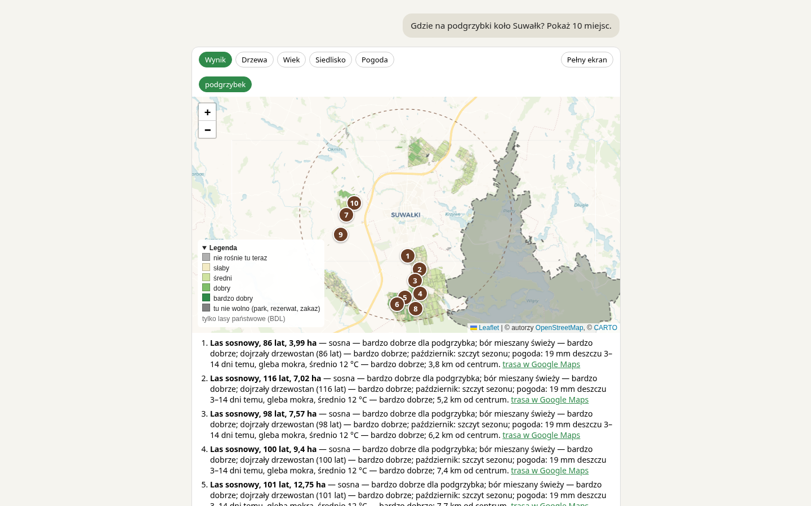
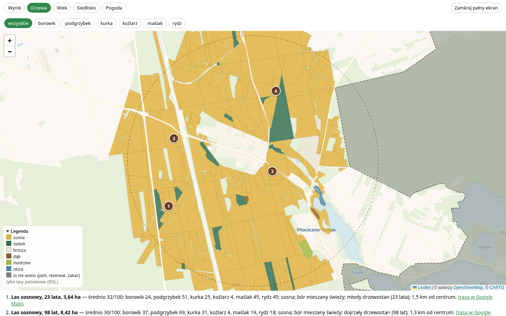
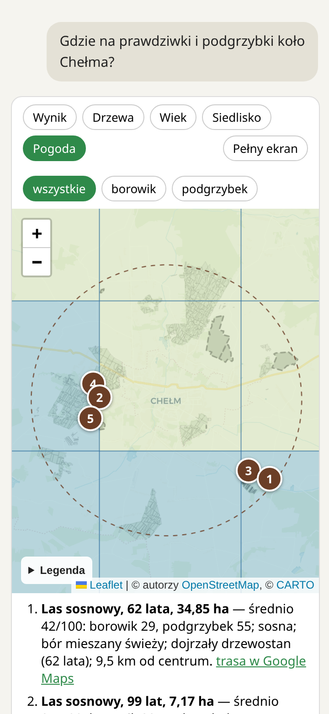
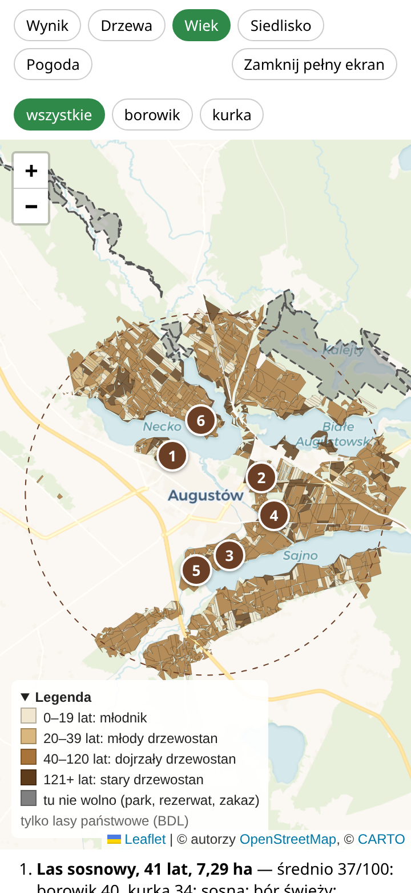

# Gdzie na grzyby

Podpowiadacz dla grzybiarzy w Twoim chatbocie (Claude, ChatGPT). Pytasz po prostu: „gdzie na
podgrzybki koło Suwałk?”, a w odpowiedzi dostajesz **mapę lasów w okolicy** pokolorowaną według
szans, **ponumerowane najlepsze miejsca** z uzasadnieniem i **link do trasy** w Google Maps.





<p align="center">
  
  
</p>

## Co dostajesz

- **Miejsca, nie ogólniki.** Konkretne kawałki lasu (drzewostany) w promieniu, który podasz, co
  najmniej kilometr od siebie, ponumerowane na mapie — domyślnie 3, na prośbę do 15.
- **Dlaczego właśnie tam:** jakie drzewa, jaki las, ile ma lat, czy to sezon na ten grzyb i jaka
  była pogoda — deszcz sprzed kilku dni, wilgotność gleby, temperatura, przymrozki.
- **Każdy grzyb osobno.** Borowik, podgrzybek, kurka, koźlarz, maślak, rydz — każdy lubi co innego,
  więc każdy ma swoje miejsca. Pytasz o kilka naraz: dostajesz miejsca na wszystkie i na każdy z osobna.
- **Mapa z trybami:** wynik, drzewa, wiek, siedlisko (typ lasu) i pogoda. Kliknięcie w las pokazuje,
  skąd jego ocena. Na telefonie i na pełnym ekranie też.
- **Kiedy jechać:** „kiedy najlepiej na kurki koło Augustowa?” — ocena okolicy na dziś i na 5 dni
  naprzód, z najlepszym dniem.
- **Tylko tam, gdzie wolno:** pomija parki narodowe, rezerwaty i lasy z aktualnym zakazem wstępu
  (np. przy zagrożeniu pożarowym).

Działa w całej Polsce. Pierwsze pytanie o nową okolicę trwa kilka sekund, bo dane o lasach dopiero
przychodzą; potem jest szybko.

## Jak podłączyć

Adres serwera: **`https://grzyby.gugnowski.com/mcp`** — bez logowania i bez klucza.

**Claude** (claude.ai, aplikacja na komputer i telefon):

1. Ustawienia → **Konektory** → **Dodaj własny konektor**.
2. Nazwa: `grzyby`, adres: `https://grzyby.gugnowski.com/mcp`. Zapisz.
3. W nowej rozmowie włącz konektor (ikona narzędzi pod polem wiadomości) i zapytaj, np.
   „Gdzie dziś na prawdziwki koło Olsztyna?”.

**ChatGPT:** w ustawieniach włącz tryb dewelopera i dodaj aplikację (konektor) z tym samym adresem,
bez uwierzytelniania.

**Claude Code:**

```sh
claude mcp add --transport http grzyby https://grzyby.gugnowski.com/mcp
```

Po aktualizacji serwera odłącz i podłącz konektor ponownie, jeśli mapa wygląda po staremu —
chatboty zapamiętują jej starą wersję.

## Czego nie wie

- **Zna tylko lasy państwowe.** Lasy prywatne i gminne są na mapie puste — nie dlatego, że nic tam
  nie rośnie, tylko dlatego, że nie ma o nich danych.
- **Ocena to wzór, nie wyrocznia.** Łączy wiedzę grzybiarzy o tym, co który grzyb lubi, z pogodą
  ostatnich dni. Podpowiada, gdzie warto zacząć; grzyby i tak trzeba znaleźć samemu — i znać.
  Nie zbieraj grzybów, których nie umiesz rozpoznać.
- **Zakazy wstępu sprawdzaj na miejscu** — tablice przy lesie są ważniejsze niż mapa.

## Skąd dane

- Drzewostany i zakazy wstępu: [Bank Danych o Lasach](https://www.bdl.lasy.gov.pl/) (CC BY 4.0).
- Parki narodowe i rezerwaty: Generalna Dyrekcja Ochrony Środowiska.
- Pogoda: [Open-Meteo](https://open-meteo.com/) (CC BY 4.0).
- Położenie miejscowości: Nominatim, © autorzy [OpenStreetMap](https://www.openstreetmap.org/copyright).
- Podkład mapy: © autorzy OpenStreetMap, © [CARTO](https://carto.com/attributions).

Projekt hobbystyczny, darmowy, bez reklam i bez zbierania danych o Tobie.

Dla programistów: [docs/dev/README.md](docs/dev/README.md).
